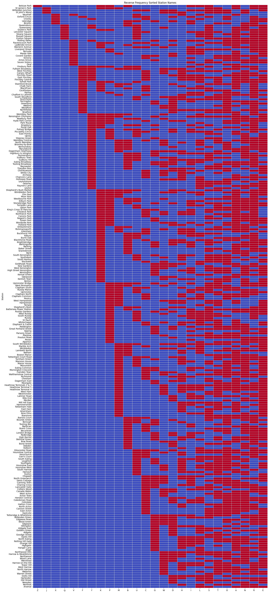

# 🚇 London Underground Name Fun Project: A Journey Through the Alphabet

[👋 Hello, Threads Community!](https://www.threads.net/@bowlofchalk/post/C-hKosIopxE) 🎉

Welcome to a quirky and fun exploration of London Underground station names! If you’ve ever pondered the oddities of station name letters—or found yourself wondering about *MACKEREL*—you’re in for a treat. Spoiler alert: **St John's Wood** is the only station on the Tube without any letters from *MACKEREL*. But there’s so much more to uncover!

## 🔍 What’s in a Name?

This project is all about discovering fascinating patterns in the letters of station names. Here’s what we found:

## 🎉 Fun Facts

- **St John's Wood**: The only station on the London Underground network that doesn’t have a single letter from the word *MACKEREL*. A true outlier!
- **Pimlico** and **Dollis Hill**: These two stations are the only ones that pass the "NEAR" test—no `N`, `E`, `A`, or `R` in their names.
- **Chigwell**: This station could pass the "ASTRONOMY" test. With no `A`, `S`, `T`, `R`, `O`, `N`, `M`, or `Y` in its name.
- **Redbridge**: While it doesn’t contain `A`, `N`, `O`, `T`, `S`, `L`, or `C`, we couldn't come up with a meaningful word that it fully avoids. It's a unique outlier in its own right.
- **Bank** and **Barking**: These two stations are the only ones that pass the "CLOTHES" test—no `C`, `L`, `O`, `T`, `H`, `E`, or `S` in their names.
- **Belsize Park**: The only station on the network with a `Z`.
- **St James Park**, **Willesden Junction**, and **St John's Wood**: These three stations are the only ones that feature a `J`. If you’re a fan of this letter, these are your stops.
- **Vauxhall**: The only station that boasts both an `X` and a `V`, making it doubly rare and unique on the network.
- **Brixton**, **Uxbridge**, **Croxley**, **Oxford Circus**, and **Vauxhall**: The exclusive club of stations with an `X`. These stations add a special flair to the Tube map.
- **Euston Square**, **Russell Square**, **Sloane Square**, **Queens Park**, **Queensway**, and **Kingsbury**: The letter `Q` is reserved for stations with "Square" or "Queen" in their names, almost as if it’s part of a royal decree!
- **Oval**: The station with the fewest unique letters—just 4 distinct letters make up its name. A minimalist masterpiece.
- **Heathrow Terminals 2 & 3**: The station with the most unique letters on the network—an impressive 15 distinct letters. A true alphabet champion!
  
### 🔥 Heatmaps

- **📈 Frequency Insight:**
  Here, station names are sorted by how often each letter appears, grouping stations with the most common letters together. **St John's Wood** stands out as the fifth from the bottom.

  

- **🔠 Unique Letters Insight:**
  What about those stations with rare letters? This heatmap flips the frequency order, putting the stations with the rarest letters (like `Z` and `J`) at the bottom.

  

- **🅰️ Alphabetical Insight:**

  

### 📝 Letter Frequency in Station Names
`E`, `R`, `A`, `N`, `O`, `T`, `S`, `L`, `I`, `H`, `D`, `W`, `G`, `C`, `U`, `B`, `M`, `P`, `K`, `Y`, `F`, `V`, `Q`, `X`, `J`, `Z`

---

Thanks for joining the fun! If you’re curious to see more or just want to chat about it, don’t forget to check out the original [Threads post](https://www.threads.net/@bowlofchalk/post/C-hKosIopxE)!
